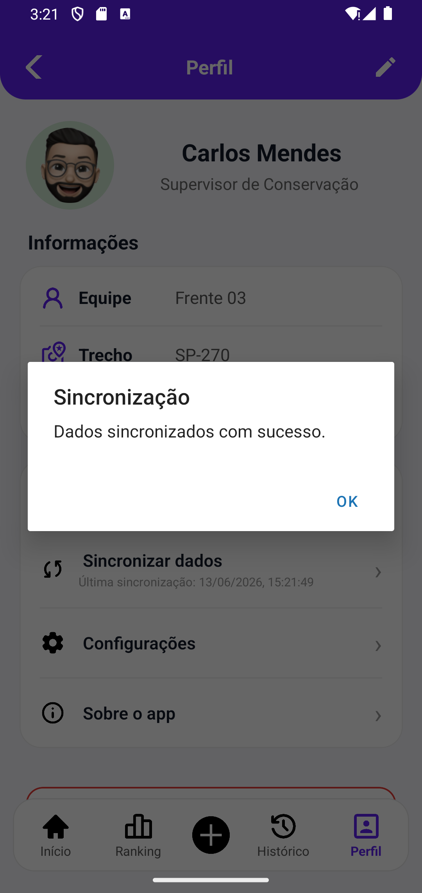

# 🌱 EcoTrack

### Sprint 2 — Cross-Platform Application Development | FIAP

<p align="center">
  
</p>

---

## 📋 Descrição do Projeto

O EcoTrack é uma aplicação mobile desenvolvida para o Challenge CCR Motiva, com o objetivo de apoiar equipes de campo e supervisores no monitoramento e registro de ocorrências relacionadas à conservação da faixa de domínio das rodovias.

A solução permite registrar ocorrências, anexar evidências fotográficas, capturar localização, acompanhar históricos, visualizar rankings de criticidade e gerenciar informações operacionais por meio de uma interface intuitiva e responsiva.

---

## 🎯 Objetivo da Sprint 2

Transformar o protótipo desenvolvido na Sprint 1 em uma aplicação funcional utilizando React Native e Expo, implementando:

- Navegação entre telas
- Cadastro de ocorrências
- Consulta de registros
- Filtros dinâmicos
- Captura de localização
- Upload de imagens
- Gerenciamento de perfil
- Persistência local de dados

---

## 👥 Equipe

| Nome | RM |
|--------|--------|
| Fernando de Almeida Godoi Martines | RM 564820 |
| Gabriel Ber Soares Tarone | RM 563520 |
| Guilherme de Freitas Salgado | RM 562494 |
| Bruno Anselmo Da Silva | RM 566521 |
| Vinicius Ribeiro Dias | RM 566468 |

---

# 🚀 Funcionalidades Implementadas

✅ Login com validação

✅ Seleção de perfil de acesso

✅ Dashboard com indicadores

✅ Cadastro de ocorrências

✅ Registro fotográfico

✅ Captura de localização

✅ Histórico de ocorrências

✅ Filtros por status

✅ Filtros por criticidade

✅ Ranking de ocorrências críticas

✅ Consulta detalhada

✅ Edição de ocorrências

✅ Edição de perfil

✅ Alteração de senha

✅ Configurações do aplicativo

✅ Sincronização de dados

✅ Logout

---

# 📱 Telas do Aplicativo

---

## 00. Splash Screen

<p align="center">
  
</p>

Tela de abertura responsável por apresentar a identidade visual do aplicativo antes do carregamento da autenticação.

---

## 01. Login

<p align="center">
  
  
</p>

Funcionalidades:

- Validação de e-mail
- Validação de senha
- Exibição e ocultação de senha
- Seleção de perfil
- Navegação para o sistema

---

## 02. Dashboard Inicial

<p align="center">
  
  
  
</p>

<p align="center">
  
</p>

Funcionalidades:

- Indicadores operacionais
- Quantidade de ocorrências
- Ranking resumido
- Menu lateral
- Central de notificações

---

## 04. Confirmação de Envio

<p align="center">
  
</p>

Funcionalidades:

- Protocolo automático
- Status inicial da ocorrência
- Retorno ao dashboard

---

## 05. Ranking de KMs Críticos

<p align="center">
  
  
</p>

Funcionalidades:

- Busca por KM
- Filtro por criticidade
- Classificação por prioridade
- Navegação para histórico

---

## 06. Registro de Ocorrência

<p align="center">
  
  
  
</p>

Funcionalidades:

- Cadastro de ocorrências
- Inclusão de novos tipos
- Registro fotográfico
- Captura de localização atual
- Validação de campos obrigatórios

---

## 06. Detalhes da Ocorrência

<p align="center">
  
  
  
</p>

<p align="center">
  
  
</p>

Funcionalidades:

- Consulta completa da ocorrência
- Visualização de evidências
- Atualização de status
- Edição de informações
- Controle operacional

---

## 07. Histórico de Ocorrências

<p align="center">
  
  
  
</p>

Funcionalidades:

- Histórico completo
- Busca por KM
- Busca por tipo
- Filtro por status
- Filtro por criticidade
- Consulta detalhada

---

## 08. Perfil e Configurações

<p align="center">
  
  
  
</p>

<p align="center">
  
  
  
</p>

Funcionalidades:

- Edição de informações pessoais
- Alteração de senha
- Configurações do aplicativo
- Sincronização de dados
- Informações institucionais
- Logout

---

# 🛠 Tecnologias Utilizadas

- React Native
- Expo
- JavaScript
- Context API
- AsyncStorage
- Expo Image Picker
- Expo Location

---

# 📂 Estrutura do Projeto

```text
ecotrack/
│
├── assets/
│   ├── icons/
│   ├── images/
│   └── screenshots/
│
├── components/
│
├── context/
│
├── screens/
│
├── App.js
│
└── README.md
```

---

# ▶️ Como Executar

```bash
npm install
```

```bash
npx expo start
```

---

# 🎓 FIAP

Projeto acadêmico desenvolvido para a disciplina Cross-Platform Application Development.
